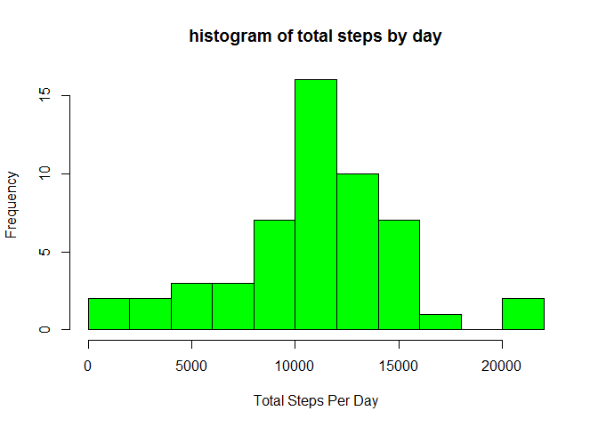
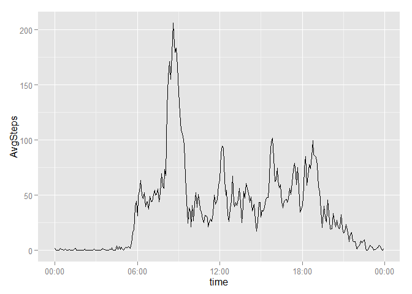
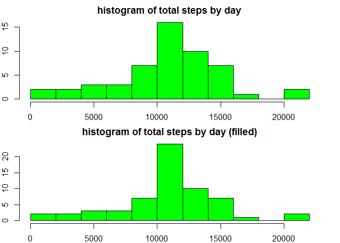
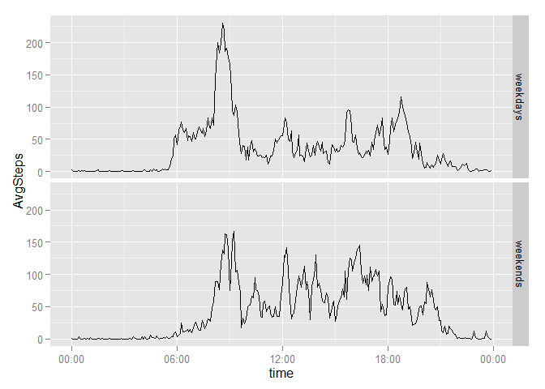

# Reproducible Research: Peer Assessment 1


## Loading and preprocessing the data
Following code set working directory, load data:

```r
#setwd("../desktop/learning/reproducibleresearch/RepData_PeerAssessment1")
actdata<-read.csv("activity.csv",header=TRUE,colClasses=c("numeric","Date","numeric"))
```

Next we are going to preprocess the data. We change the date and interval to time format, add more columns to it.

```r
library(lubridate)
library(dplyr)
maturedata<-actdata%>%mutate(absinterval=floor(interval/100)*60+interval%%100)
minute(maturedata$date)<-maturedata$absinterval
maturedata<-select(maturedata,steps,date,interval)
names(maturedata)<-c("steps","time","interval")
maturedata<-mutate(maturedata,date=as.Date(time),month=month(time),monthday=day(time),weekday=wday(time))
```
See what mature data look like:

```r
head(maturedata)
```

```
##   steps                time interval       date month monthday weekday
## 1    NA 2012-10-01 00:00:00        0 2012-10-01    10        1       2
## 2    NA 2012-10-01 00:05:00        5 2012-10-01    10        1       2
## 3    NA 2012-10-01 00:10:00       10 2012-10-01    10        1       2
## 4    NA 2012-10-01 00:15:00       15 2012-10-01    10        1       2
## 5    NA 2012-10-01 00:20:00       20 2012-10-01    10        1       2
## 6    NA 2012-10-01 00:25:00       25 2012-10-01    10        1       2
```
Now we can use this for further analysis.

## What is mean total number of steps taken per day?

First we select steps and date, group by date, and summarise it (NAs will be removed).
Second we plot it to a histogram:

```r
TotalByDay<-maturedata%>%select(steps,date)%>%group_by(date)%>%summarise(totalsteps=sum(steps))%>%filter(!is.na(totalsteps))
hist(TotalByDay$totalsteps,col="green",breaks=15,main="histogram of total steps by day",xlab="Total Steps Per Day")
```

 

The mean and median:

```r
options(scipen=1, digits=1)
meanperday<-mean(TotalByDay$totalsteps)
medianperday<-median(TotalByDay$totalsteps)
meanperday; medianperday
```

```
## [1] 10766
```

```
## [1] 10765
```
we could see the mean and median of total number steps taken per day are 10766 and 10765.

## What is the average daily activity pattern?
First we process the mature data based on daily activity:

```r
AvgDailyAct<-maturedata%>%mutate(timeofday=format(time,format="%H:%M:%S"))%>%select(timeofday,steps)%>%group_by(timeofday)%>%summarise(AvgSteps=mean(steps,na.rm=TRUE))
library(ggplot2)
library(scales)
AvgDailyAct<-mutate(AvgDailyAct,time=as.POSIXct(timeofday,format="%H:%M:%S"))
```
Now we use ggplot2 to plot it:

```r
ggplot(data=AvgDailyAct,aes(time,AvgSteps))+geom_line()+scale_x_datetime(labels=date_format("%H:%M"))
```

 

Which 5-minute interval, on average across all the days in the dataset, contains the maximum number of steps?

```r
AvgDailyAct$timeofday[which.max(AvgDailyAct$AvgSteps)]
```

```
## [1] "08:35:00"
```

## Imputing missing values
Let's calculate the missing values:

```r
sum(is.na(maturedata$steps))
```

```
## [1] 2304
```
Now we fill the data with AVERAGE value of the same time in all other days, and store it in variable "filled":

```r
maturedata<-maturedata%>%mutate(timeofday=format(time,format="%H:%M:%S"))
filled<-merge(maturedata,AvgDailyAct[,1:2],all.x=TRUE)[,2:9]
filled<-filled%>%mutate(steps=ifelse(is.na(steps),round(AvgSteps),steps))
filled<-filled[order(filled$time),]
head(filled)
```

```
##     steps                time interval       date month monthday weekday
## 1       2 2012-10-01 00:00:00        0 2012-10-01    10        1       2
## 63      0 2012-10-01 00:05:00        5 2012-10-01    10        1       2
## 128     0 2012-10-01 00:10:00       10 2012-10-01    10        1       2
## 205     0 2012-10-01 00:15:00       15 2012-10-01    10        1       2
## 264     0 2012-10-01 00:20:00       20 2012-10-01    10        1       2
## 327     2 2012-10-01 00:25:00       25 2012-10-01    10        1       2
##     AvgSteps
## 1       1.72
## 63      0.34
## 128     0.13
## 205     0.15
## 264     0.08
## 327     2.09
```

Let's compare filled value with NA removed value to see what's the difference:

```r
TotalByDay_filled<-filled%>%select(steps,date)%>%group_by(date)%>%summarise(totalsteps=sum(steps))
par(mfrow=c(2,1),mar=c(2,1,2,1),oma=c(0,1,0,1))
hist(TotalByDay$totalsteps,col="green",breaks=15,main="histogram of total steps by day",xlab="")
hist(TotalByDay_filled$totalsteps,col="green",breaks=15,main="histogram of total steps by day (filled)",xlab="")
```

 

See the value difference:

```r
mean(TotalByDay_filled$totalsteps)
```

```
## [1] 10766
```

```r
median(TotalByDay_filled$totalsteps)
```

```
## [1] 10762
```
there is slightly difference between filled data and NA removed data in previous question.

## Are there differences in activity patterns between weekdays and weekends?
To compare differences in pattern between weekdays and weekends, instead of adding factors, I feel more comfortable of using dplyr library.
First we preprocess the data and store in "weekdata"

```r
weekdata<-filled%>%mutate(timeofday=format(time,format="%H:%M:%S"),weekends=ifelse(weekday==1|weekday==7,"weekends","weekdays"))%>%select(steps,timeofday,weekends)%>%group_by(timeofday,weekends)%>%summarise(AvgSteps=mean(steps))
weekdata<-mutate(weekdata,time=as.POSIXct(timeofday,format="%H:%M:%S"))
```
Then we use ggplot2 to plot weekday pattern and weekends pattern:

```r
ggplot(data=weekdata,aes(time,AvgSteps))+geom_line()+scale_x_datetime(labels=date_format("%H:%M"))+facet_grid(weekends~.)
```

 

This make some sense, I could guess during weekdays, this guy take exercise in the morning, then sit down working, so in the morning there is a surge, then value becomes low.
During weekends, this guy seems take less exercise in the morning, but are more active throughout the other time, since he is not sitting and working.
